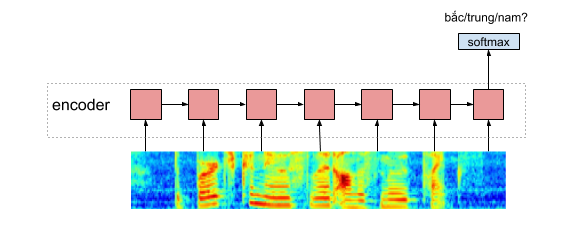

# Zalo AI Challenge
# Giới thiệu
Zalo AI challenge là cuộc thi AI đầu tiên do zalo tổ chức. Nội dung liên quan đến xử dụng âm thanh, hình ảnh và các loại dữ liệu khác. 
Source code này mình hướng dẫn basic cho các bạn để extract feature mfcc, chrom bằng librosa sử dụng multi process, cũng như mô hình LSTM đơn giản nhất đạt được 67% trên public leaderboard. Về cơ bản, thì có thể sử dụng CNN, và LSTM cũng như các mô hình tree-based như XGBoost để giải quyết bài toán này
# Feature Extract
Mình extract nhiều loại features:
* MFCC
* spectral centroid
* chroma stft
* spectral contrast

Những feature này được extract với hop length = 512ms, mình chỉ giữ lại 3s đầu tương ứng với 128 timestep. Sau đó các feature được concat với nhau và padding nếu bé hơn 3s
# Mô hình
Mình sử dụng mô hình LSTM 2 tầng đơn giản, đặc trưng được tổng hợp ở timestep cuối cùng được qua hàm softmax và predict nhãn cho mẫu dữ liễu, đối với accent thì là bắc/trung/nam, còn đối với gender thì là nam/nữ. Thời gian train khoảng 10s trên một epoch.

# Train

# Kết quả

